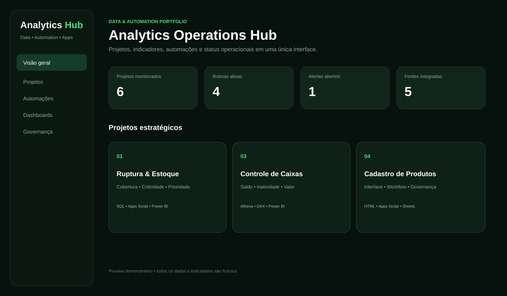
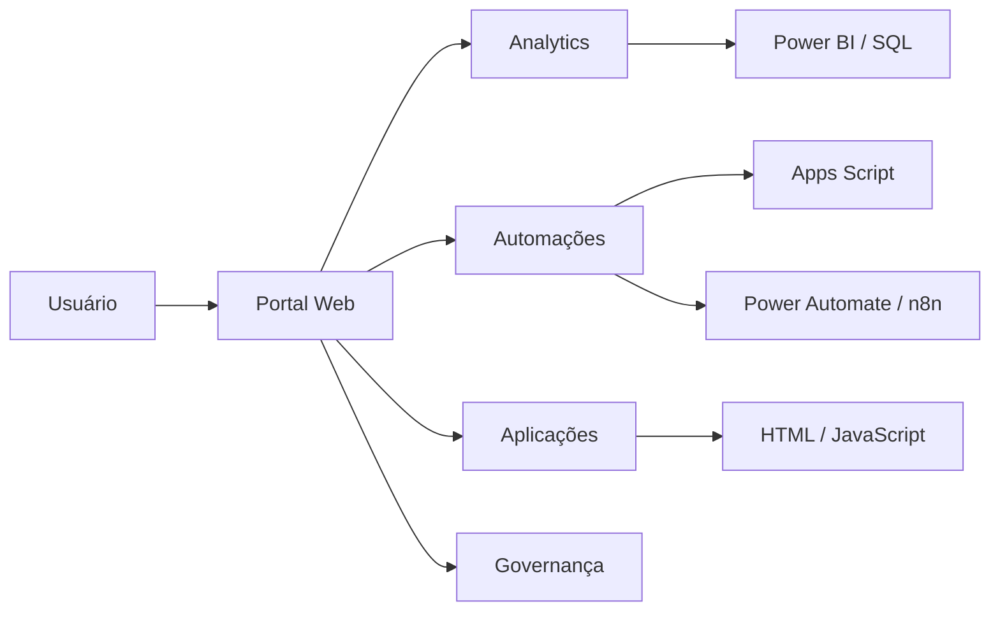
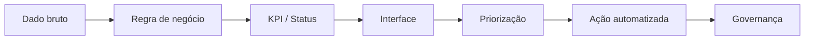

# Analytics Operations Hub — Data & Automation Application

> **CASE DE PORTFÓLIO — DADOS 100% FICTÍCIOS**

Aplicação web demonstrativa criada para centralizar **analytics, dashboards, automações, projetos e governança operacional** em uma única experiência.

O objetivo deste case é mostrar a evolução de análises e automações isoladas para um **produto de dados**: uma interface que conecta indicadores, contexto de negócio, status e ação.

## Problema

Quando dashboards, planilhas, scripts e fluxos ficam distribuídos em ferramentas diferentes, aumenta o tempo de busca, o retrabalho e a dificuldade de identificar prioridades.

## Solução

O Analytics Operations Hub organiza:

- KPIs executivos;
- catálogo de projetos;
- busca por projeto, tecnologia ou problema;
- filtros por Analytics, Automação e Aplicações;
- status operacional;
- stack utilizada;
- última atualização;
- próximos passos e ações recomendadas.

## Demo interativa

Abra [`demo/index.html`](./demo/index.html) em um navegador.

A demo foi construída em **HTML + CSS + JavaScript puro**, não depende de credenciais nem backend e utiliza somente informações fictícias.

## Arquitetura de referência

## Jornada de dados

## Competências demonstradas

- desenho de produto de dados;
- experiência do usuário aplicada à operação;
- estruturação de KPIs e status;
- HTML, CSS e JavaScript;
- integração conceitual com SQL, Power BI e Apps Script;
- automação com Power Automate/n8n;
- separação entre ambiente demonstrativo público e dados corporativos protegidos.

## Stack

`HTML` `CSS` `JavaScript` `SQL` `Power BI` `Google Apps Script` `Google Sheets` `Power Automate` `n8n` `Data Analytics`

## Segurança

Nenhum usuário, e-mail, indicador, link ou dado corporativo real é publicado neste projeto. Todos os exemplos são fictícios ou demonstrativos.

---

**Tipo:** Data Product / Aplicação Web / Analytics / Automação  
**Autor:** Michel Lucena
